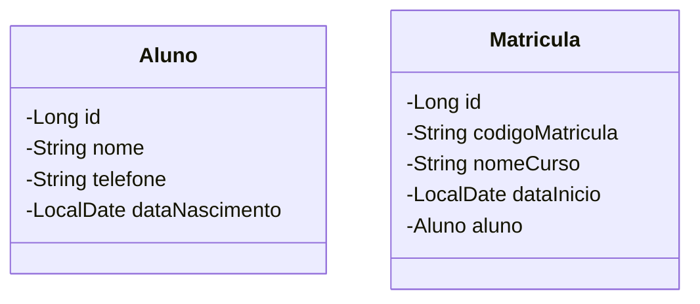

# :mortar_board: Desafio de Vaga Junior - API de Gestão de Alunos e Matrículas

Considerando o seguinte diagrama de classes

Crie uma API REST com Java e Spring Boot, voltada para o gerenciamento de <strong>alunos</strong> e duas <strong>matrículas</strong> em cursos educacionais.

## :pushpin: Descrição do Desafio

A API deve permitir:

* ✅ Cadastrar um aluno junto com suas matrículas
* ✅ Listar todos os alunos cadastrados
* ✅ Listar todos as matrículas de um aluno a partir do seu ID
* ✅ Atualizar os dados cadastrais de um aluno (e suas matrículas)
* ✅ Remover um aluno (e suas matrículas associadas)

## :rocket: Tecnologias Utilizadas

* Java 17
* Spring Boot 3+
* Spring Data JPA
* H2 Database (barnco embarcado)
* Maven
* REST Client (arquivo .http para testes rápidos)

